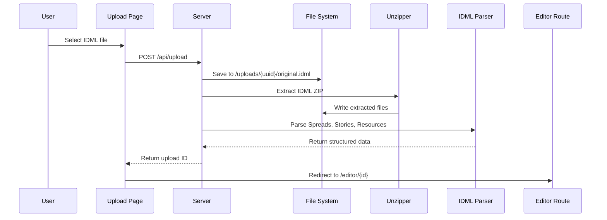
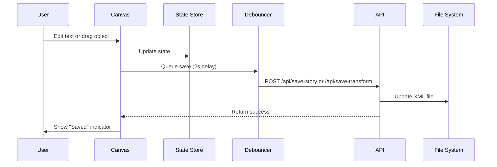
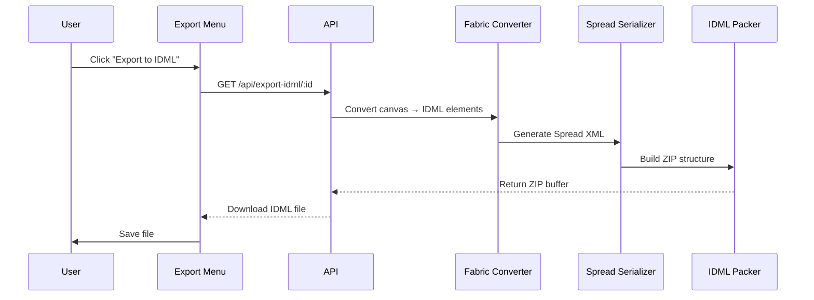

# IDML Web Editor - Architecture Documentation

> Last Updated: January 10, 2026

## Table of Contents

1. [System Overview](#system-overview)
2. [Technology Stack](#technology-stack)
3. [Data Flow](#data-flow)
4. [Core Components](#core-components)
5. [IDML Processing Pipeline](#idml-processing-pipeline)
6. [Canvas Rendering System](#canvas-rendering-system)
7. [State Management](#state-management)
8. [Export System](#export-system)
9. [Performance Optimizations](#performance-optimizations)
10. [Security Considerations](#security-considerations)

---

## System Overview

The IDML Web Editor is a comprehensive web-based application that enables users to upload, edit, and export Adobe InDesign IDML files directly in the browser without requiring Adobe InDesign.

### High-Level Architecture

```
┌─────────────────────────────────────────────────────────────┐
│                        Browser (Client)                      │
├─────────────────────────────────────────────────────────────┤
│  React UI Components (Remix)                                 │
│  ├─ Upload Interface                                        │
│  ├─ Editor Layout (InDesign-like 3-panel UI)               │
│  └─ Export Menu                                             │
├─────────────────────────────────────────────────────────────┤
│  State Management (Zustand)                                 │
│  ├─ Document State (spreads, stories, colors)              │
│  ├─ UI State (current spread, zoom, selection)             │
│  └─ Canvas Instance                                         │
├─────────────────────────────────────────────────────────────┤
│  Canvas Rendering (Fabric.js)                               │
│  ├─ IDML → Fabric Converter                                │
│  ├─ Text Editing (IDMLTextFrame)                           │
│  ├─ Transform Handling                                      │
│  └─ Performance Optimizer                                   │
├─────────────────────────────────────────────────────────────┤
│  Business Logic                                              │
│  ├─ IDML Parser (xml2js)                                   │
│  ├─ Color Manager (CMYK → RGB)                             │
│  ├─ Story Serializer (Text → XML)                          │
│  └─ Export System (IDML, HTML, PDF)                        │
└─────────────────────────────────────────────────────────────┘
                            ↕ HTTP API
┌─────────────────────────────────────────────────────────────┐
│                    Server (Remix Loaders/Actions)            │
├─────────────────────────────────────────────────────────────┤
│  API Endpoints                                               │
│  ├─ POST /api/upload                                        │
│  ├─ POST /api/save-story                                    │
│  ├─ POST /api/save-transform                                │
│  ├─ GET /api/export-idml/:id                                │
│  └─ GET /api/export-html/:id                                │
└─────────────────────────────────────────────────────────────┘
                            ↕
┌─────────────────────────────────────────────────────────────┐
│                    File System Storage                       │
├─────────────────────────────────────────────────────────────┤
│  /uploads/{uuid}/                                           │
│  ├─ original.idml                                           │
│  └─ extracted/                                              │
│      ├─ Spreads/         (layout XML files)                │
│      ├─ Stories/         (text content XML)                │
│      ├─ Resources/       (styles, colors, fonts)           │
│      └─ MasterSpreads/   (page templates)                  │
└─────────────────────────────────────────────────────────────┘
```

---

## Technology Stack

### Frontend

| Technology | Version | Purpose |
|------------|---------|---------|
| **Remix** | 2.13.1 | React framework with server-side rendering |
| **TypeScript** | 5.6.3 | Type-safe JavaScript |
| **TailwindCSS** | 3.4.4 | Utility-first CSS framework |
| **Fabric.js** | 5.3.0 | HTML5 canvas rendering library |
| **Zustand** | 4.5.0 | Lightweight state management |

### Backend

| Technology | Version | Purpose |
|------------|---------|---------|
| **Node.js** | ≥20.0.0 | JavaScript runtime |
| **xml2js** | Latest | XML parsing and building |
| **unzipper** | Latest | IDML extraction (ZIP) |
| **JSZip** | 3.10.0 | IDML repacking (ZIP) |

### Development Tools

| Tool | Version | Purpose |
|------|---------|---------|
| **Vite** | 5.1.0 | Build tool and dev server |
| **Playwright** | 1.57.0 | End-to-end testing |
| **SST Ion** | 3.2.38 | Infrastructure deployment |

---

## Data Flow

### Upload Flow



### Edit Flow



### Export Flow



---

## Core Components

### 1. IDML Parser (`/app/lib/processIdml.ts`)

**Responsibility**: Parse IDML files into structured TypeScript objects

**Key Functions**:
- `processIdml(uploadId)` - Main entry point
- Extracts ZIP archive to file system
- Parses all Spread XML files
- Parses all Story XML files
- Parses Resources/Graphic.xml for colors

**Output**: Structured data with spreads, stories, colors

### 2. FabricCanvas (`/app/lib/canvas/fabricCanvas.ts`)

**Responsibility**: Wrapper around Fabric.js for IDML rendering

**Key Methods**:
- `loadSpread(spread)` - Render spread onto canvas
- `parseItemTransform(matrix)` - Convert IDML matrix to Fabric transform
- `createTextFrame()` - Create IDMLTextFrame from IDML data
- `createRectangle()` - Create rectangle from IDML data
- `createLine()` - Create line from IDML data

**Transform Handling**:
```typescript
// IDML uses 6-value matrix: [a b c d tx ty]
// Represents: | a  c  tx |
//             | b  d  ty |

// Decompose to Fabric properties:
scaleX = √(a² + b²)
scaleY = √(c² + d²)
angle = atan2(b, a) × 180/π
left = tx × 0.75  // points to pixels
top = ty × 0.75
```

### 3. IDMLTextFrame (`/app/lib/canvas/textFrame.ts`)

**Responsibility**: Custom Fabric IText class with IDML-specific features

**Features**:
- Editable text with character formatting
- Paragraph formatting (alignment, spacing)
- Track modifications
- Store parent story reference
- Character style ranges

**Change Detection**:
```typescript
hasChanged(): boolean {
  return this.text !== this.originalText ||
         this.hasStyleChanges();
}
```

### 4. Editor Store (`/app/lib/state/editorStore.ts`)

**Responsibility**: Zustand store for global application state

**State Structure**:
```typescript
{
  uploadId: string | null
  spreads: IDMLSpread[]
  stories: Record<string, StoryData>
  colors: IDMLColor[]
  currentSpreadIndex: number
  zoom: number
  canvasInstance: fabric.Canvas | null
  selectedObjects: fabric.Object[]
}
```

**Key Actions**:
- `setCurrentSpreadIndex(index)`
- `setZoom(zoom)`
- `setCanvasInstance(canvas)`
- `getCurrentSpread()`

### 5. Color Manager (`/app/lib/colors/colorManager.ts`)

**Responsibility**: Parse and manage IDML colors

**CMYK → RGB Conversion**:
```typescript
function cmykToRgb(c: number, m: number, y: number, k: number): string {
  // c, m, y, k are 0-100
  const r = Math.round(255 * (1 - c/100) * (1 - k/100));
  const g = Math.round(255 * (1 - m/100) * (1 - k/100));
  const b = Math.round(255 * (1 - y/100) * (1 - k/100));
  return `rgb(${r}, ${g}, ${b})`;
}
```

**Note**: This is approximate and not color-managed.

---

## IDML Processing Pipeline

### Phase 1: Extraction

1. Receive uploaded IDML file
2. Generate UUID for upload
3. Save to `/uploads/{uuid}/original.idml`
4. Extract ZIP to `/uploads/{uuid}/extracted/`

### Phase 2: Parsing

1. **Parse Spreads**: Read all `Spreads/Spread_*.xml` files
   - Extract Page elements
   - Extract TextFrame, Rectangle, Polygon, Line, Oval elements
   - Parse GeometricBounds format: `[y1, x1, y2, x2]`
   - Parse ItemTransform matrices

2. **Parse Stories**: Read all `Stories/Story_*.xml` files
   - Extract ParagraphStyleRange elements
   - Extract CharacterStyleRange elements
   - Extract Content text
   - Build character style map

3. **Parse Colors**: Read `Resources/Graphic.xml`
   - Extract Color elements
   - Parse ColorValue (CMYK)
   - Convert to RGB for web rendering

### Phase 3: Rendering

1. Convert IDML elements to Fabric.js objects
2. Apply transforms (rotation, scale, position)
3. Apply colors and strokes
4. Load text into editable TextFrames
5. Render on canvas

---

## Canvas Rendering System

### Coordinate System

**IDML Coordinates**:
- Origin: Top-left of spread
- Units: Points (72 points = 1 inch)
- Format: `[y1, x1, y2, x2]` (unusual order!)

**Fabric.js Coordinates**:
- Origin: Top-left of canvas
- Units: Pixels
- Conversion: `pixels = points × 0.75`

### Transform Composition

When user drags/resizes object, we need to save back to IDML:

```typescript
function composeItemTransform(obj: fabric.Object): string {
  const scaleX = obj.scaleX || 1;
  const scaleY = obj.scaleY || 1;
  const angle = (obj.angle || 0) * Math.PI / 180;

  // Compose rotation matrix
  const cos = Math.cos(angle);
  const sin = Math.sin(angle);

  // Apply scale
  const a = scaleX * cos;
  const b = scaleX * sin;
  const c = -scaleY * sin;
  const d = scaleY * cos;

  // Convert position back to points
  const tx = (obj.left || 0) / 0.75;
  const ty = (obj.top || 0) / 0.75;

  return `${a} ${b} ${c} ${d} ${tx} ${ty}`;
}
```

### Element Types

| IDML Type | Fabric Type | Notes |
|-----------|-------------|-------|
| TextFrame | IDMLTextFrame (custom IText) | Editable text |
| Rectangle | fabric.Rect | Stroked/filled rectangle |
| Polygon | fabric.Polygon | Path with points |
| Line | fabric.Line | Straight line with stroke |
| Oval | fabric.Ellipse | Ellipse shape |
| Group | fabric.Group | Grouped objects |

---

## State Management

### Zustand Store Pattern

We use Zustand for its simplicity and performance:

```typescript
export const useEditorStore = create<EditorState>((set, get) => ({
  // State
  uploadId: null,
  spreads: [],
  currentSpreadIndex: 0,

  // Actions
  setCurrentSpreadIndex: (index) => set({ currentSpreadIndex: index }),

  // Derived state
  getCurrentSpread: () => {
    const { spreads, currentSpreadIndex } = get();
    return spreads[currentSpreadIndex];
  },
}));
```

### State Hydration

On editor mount:
1. Fetch IDML data from server (loader)
2. Populate Zustand store
3. Initialize canvas with first spread
4. Store canvas instance in Zustand

---

## Export System

### IDML Export

1. **Convert Canvas → IDML**:
   - Iterate over all Fabric objects
   - Extract metadata (IDML ID, type, attributes)
   - Compose ItemTransform matrix
   - Build IDML element structures

2. **Generate Spread XML**:
   - Use xml2js Builder
   - Preserve original attributes
   - Update only modified elements
   - Maintain XML element order (IDML spec requirement)

3. **Repack ZIP**:
   - Create JSZip instance
   - Add mimetype first (uncompressed!)
   - Add all original files
   - Replace modified Spread/Story XML files
   - Generate ZIP buffer with DEFLATE compression

4. **Download**:
   - Return as `application/octet-stream`
   - Filename: `document_{id}_modified.idml`

### HTML Export

1. **Generate HTML**:
   - Create container div for spread
   - Iterate over canvas objects
   - Generate div/span elements with absolute positioning
   - Embed text content

2. **Generate CSS**:
   - Absolute positioning for layout fidelity
   - Font families with fallbacks
   - Colors from RGB conversion
   - Transform CSS properties

3. **Package**:
   - Create ZIP with index.html, styles.css, assets/
   - Add README with usage instructions

---

## Performance Optimizations

### Canvas Optimizations

**Object Caching** (`enableCanvasOptimizations`):
```typescript
fabric.Object.prototype.objectCaching = true;
fabric.Object.prototype.statefullCache = true;
```

**Viewport Culling** (`cullOffscreenObjects`):
- Only render objects within viewport bounds
- Mark offscreen objects as not dirty
- Reduces render time for large documents

**Throttled Rendering** (`throttleRendering`):
- Limit rendering to 30fps during drag operations
- Use `requestAnimationFrame` for smooth updates
- Prevents performance issues with complex spreads

### Spread Caching

**SpreadCache** class:
- LRU (Least Recently Used) cache
- Keep only 3 spreads in memory at a time
- Evict oldest spread when cache full
- Dramatically reduces memory usage for large documents

**Usage**:
```typescript
const cache = new SpreadCache(3);

// Load spread
let spread = cache.get(spreadId);
if (!spread) {
  spread = await loadSpread(spreadId);
  cache.set(spreadId, spread);
}
```

### Auto-Save Debouncing

- 2-second debounce on text changes
- Prevents excessive API calls during typing
- Batches multiple edits into single save

---

## Security Considerations

### File Upload

- **File Type Validation**: Only accept `.idml` files
- **Size Limit**: 50MB max (configurable)
- **UUID Isolation**: Each upload gets unique directory
- **No Code Execution**: XML parsing is safe (xml2js)

### XML Injection

- **Sanitization**: Special characters escaped in XML
- **Entity Encoding**: `<`, `>`, `&`, `"`, `'` properly encoded
- **No User Scripts**: No JavaScript in generated HTML exports

### File System Access

- **Sandboxed**: Uploads isolated to `/uploads/{uuid}/`
- **No Path Traversal**: UUID prevents directory traversal attacks
- **Read-Only**: Original IDML never modified, only extracted copy

---

## Future Enhancements

### Planned Features

1. **PDF Export**: Server-side rendering with Puppeteer
2. **Real-Time Collaboration**: WebSocket for multi-user editing
3. **Version History**: Track and restore previous versions
4. **Cloud Storage**: S3/GCS integration for uploads
5. **Font Embedding**: Support for custom font uploads

### Architectural Improvements

1. **Web Workers**: Move XML parsing off main thread
2. **Virtual Scrolling**: For documents with 100+ pages
3. **Incremental Rendering**: Load spreads on-demand
4. **Service Worker**: Offline editing capabilities
5. **Database**: Move from file system to PostgreSQL

---

## Conclusion

The IDML Web Editor demonstrates a complex client-side application architecture that successfully bridges the gap between Adobe's proprietary IDML format and web technologies. Key architectural decisions include:

1. **Fabric.js for Canvas**: Provides robust editing capabilities
2. **Zustand for State**: Simple, performant state management
3. **Remix for SSR**: Server-side IDML processing with client-side editing
4. **File-Based Storage**: Simple deployment without database requirements
5. **Performance First**: Optimizations from the ground up

This architecture enables a production-ready web-based IDML editor that democratizes InDesign document editing.
